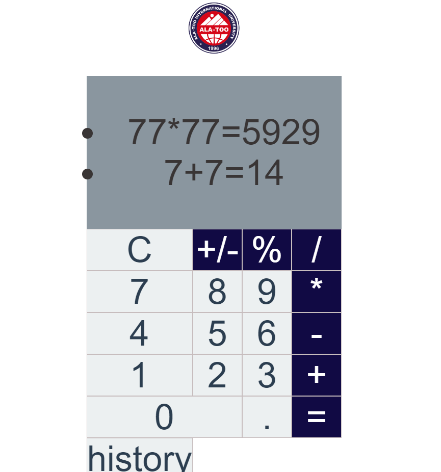

# AkzholsVueCalculator

## Introduction
AkzholsVueCalculator is a web-based calculator application built using Vue.js. This README provides an overview of the project and how to set it up for your use.

## Youtube
 [Youtube](https://youtu.be/U7FvyiTor8I?si=aBAWVzfmlEzXW3Fm)

## Project Setup
Before you can start using or contributing to the project, you need to set it up on your local development environment. Follow these steps:

### Prerequisites
- Node.js and npm should be installed on your machine.

### Installation
1. Clone this repository to your local machine using the following command:
```
git clone https://github.com/your-username/AkzholsVueCalculator.git
```

2. Navigate to the project directory:
```

cd midtermFrontend
```

3. Install the project dependencies by running:

```

npm install
```


## Usage

### Compiles and Hot-Reloads for Development
To run the project in development mode with hot-reloading, use the following command:
```

npm run serve
```


## Continuous Integration and Deployment (CI/CD)

This project utilizes GitHub Actions for continuous integration and deployment. The workflow is configured to automatically build and deploy the application to an AWS S3 bucket whenever changes are pushed to the main branch.

### CI/CD Workflow

- On every push to the main branch, the following steps are executed:

  1. Code is checked out from the repository.
  2. The application is built.
  3. The built code is deployed to the specified AWS S3 bucket.

### Secrets

To ensure secure deployment to AWS, we've configured the necessary AWS access keys as GitHub secrets. The secrets are used by the GitHub Actions workflow to authenticate with AWS S3.

**Note**: If you need to create or update AWS access keys, follow the steps in our [AWS Access Key Management Guide](link-to-guide).

### Monitoring and Logs

You can track the CI/CD workflow's progress and access logs in the GitHub Actions tab of this repository.

# Screenshots





