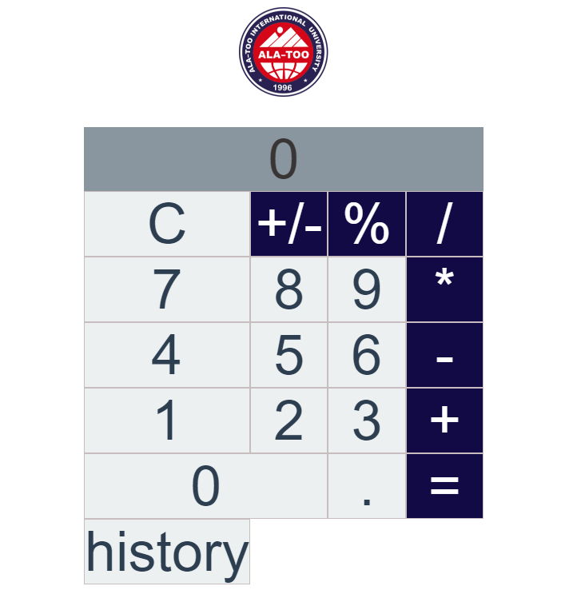

# AkzholsVueCalculator

## Introduction
AkzholsVueCalculator is a web-based calculator application built using Vue.js. This README provides an overview of the project and how to set it up for your use.

## Project Setup
Before you can start using or contributing to the project, you need to set it up on your local development environment. Follow these steps:

### Prerequisites
- Node.js and npm should be installed on your machine.

### Installation
1. Clone this repository to your local machine using the following command:
```
git clone https://github.com/your-username/AkzholsVueCalculator.git
```

2. Navigate to the project directory:
```

cd midtermFrontend
```

3. Install the project dependencies by running:

```

npm install
```


## Usage

### Compiles and Hot-Reloads for Development
To run the project in development mode with hot-reloading, use the following command:
```

npm run serve
```
# Screenshots





